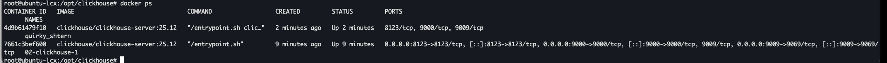

Запущенный инстанс 



Результат запроса:


```bash
da176b48c119 :) select count() from cell_towers;

SELECT count()
FROM cell_towers

Query id: 54b4f253-2fd4-44bd-890d-580c9f6cb095

   ┌──count()─┐
1. │ 43276150 │ -- 43.28 million
   └──────────┘

1 row in set. Elapsed: 0.001 sec.
```


До оптимизации:
```bash
Queries executed: 10 (100%).

localhost:9000, queries: 10, QPS: 1.407, RPS: 28143338.450, MiB/s: 1300.880, result RPS: 14068247.827, result MiB/s: 650.474.

0%              0.681 sec.      
10%             0.687 sec.      
20%             0.690 sec.      
30%             0.696 sec.      
40%             0.698 sec.      
50%             0.700 sec.      
60%             0.700 sec.      
70%             0.703 sec.      
80%             0.704 sec.      
90%             0.711 sec.      
95%             0.714 sec.      
99%             0.714 sec.      
99.9%           0.714 sec.      
99.99%          0.714 sec.      
```

Применил конфиг [config.xml](configs/config.xml)

```bash
Queries executed: 10 (100%).

localhost:9000, queries: 10, QPS: 1.390, RPS: 27807041.233, MiB/s: 1285.231, result RPS: 13900140.102, result MiB/s: 642.627.

0%              0.694 sec.      
10%             0.694 sec.      
20%             0.700 sec.      
30%             0.702 sec.      
40%             0.706 sec.      
50%             0.708 sec.      
60%             0.708 sec.      
70%             0.713 sec.      
80%             0.713 sec.      
90%             0.718 sec.      
95%             0.720 sec.      
99%             0.720 sec.      
99.9%           0.720 sec.      
99.99%          0.720 sec.      
```

Результата нет. Виртуальная машина 20 ядер на 32 памяти.